<h1> Services On Demand </h1>

## About the project
It is an android application written for android classes. It provides homes services platform to anyone registered. It gives users an ability of publishing their issues on local board, that other registered users can take and solve them. It was built with Java 11 and Firebase realtime as database. It also uses Firebase authentication service, Firebase storage for storing users profile pictures and google map API for displaying customer's location.

### Built with
* Android Studio
* Java
* Firebase Realtime Database
* Firebase Authentication
* Firebase Storage
* Google map API

## How it works
### Login and registration
Only authenticated users are able to use Services on Demand application, so if you want to publish your issues or try to help others with their problems you have to create your account first. Registration form is really simple, but before signing in, make sure that you have clicked the activation link, which were sent to your email account, because email verification is required.

  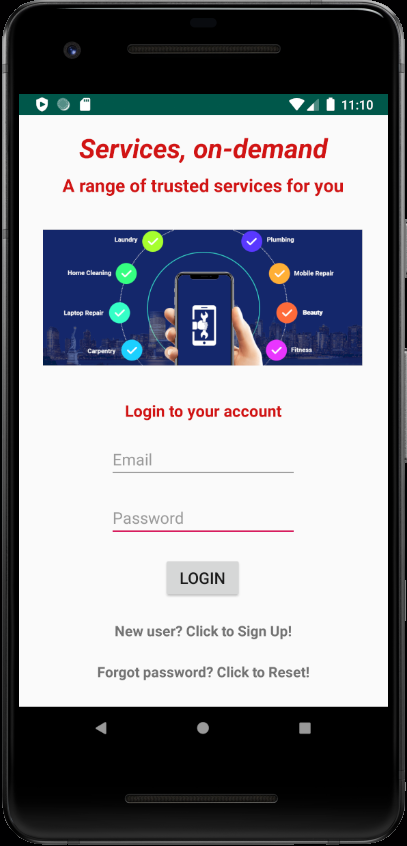
  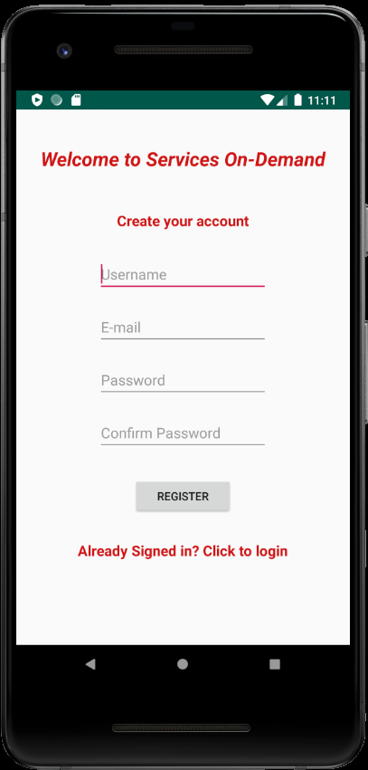

### Services on Demand Main page
From the main page you can choose what you want to do. You are able to create your new problem case, see list of your active cases, see list of all other users cases or manage your account information.

  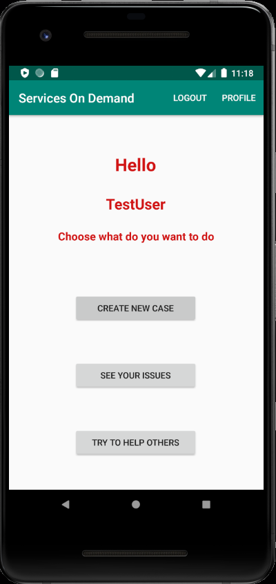

### Create new case
You need to complete simple form and leave some information, that will allowed other users to contact with you. You can enter the address field by yourself or click the "Find me" button and let the app to use your current location.

  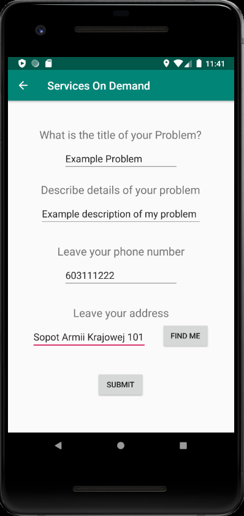

### List and details of user active cases
If you have already created some cases you can see all of them in the list. You are also able to see the details of each case to make sure that you have entered everything correctly. 

  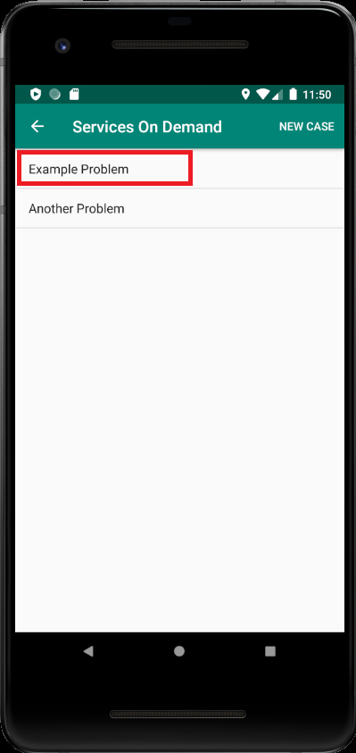
  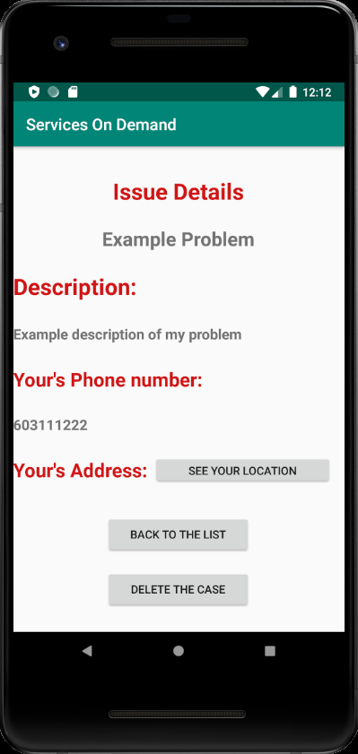

### List and details of all other active cases
Here you will be able to see all the problems that other Service on Demand users have. You can see the details of each case, see the customer's location on the map and you can declare that you are able to help someone with its problem. Surely you won't see your cases on this list, but to prove that other users can see them, this views come from the perspective of another user.

  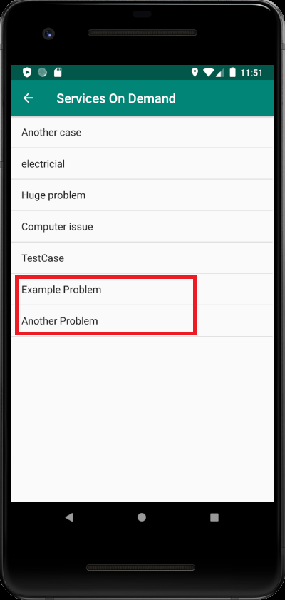
  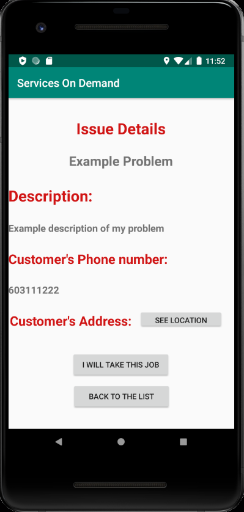
  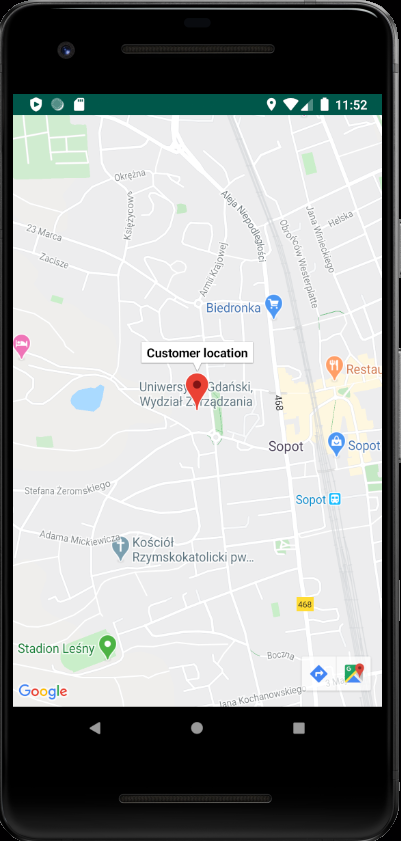

### Manage your account.
You are also able to manage your Services on Demand account. Surely you can change your username, email and password, but also you can change your profile image by uploading the picture from your android device.

  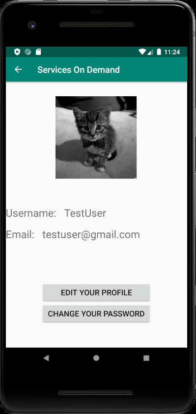
  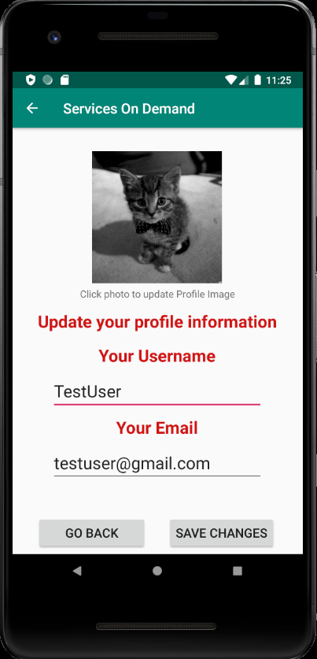
  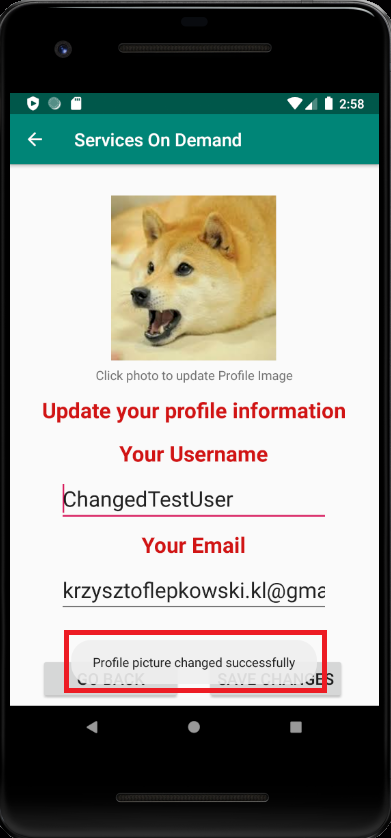

 

<h2 align="center"> Enjoy Services on Demand </h2>
<h3 align="center"> A range of trusted services for you! </h3>

  

